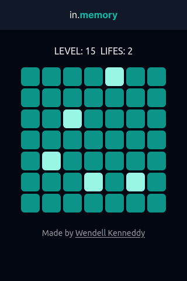

# in.memory

---

## 📕 About

A simple pattern memorization game.

---

## ⚒️ Used Technologies

To develop this app, I used these technologies:

- NextJS
- Tailwind
- Typescript
- Radix

---

## ✨ Features

- Responsivity
- Accessibility
- Mobile-first design
- Saving game history locally

---

## 🤝 Be a Contributor

Have any idea that can help boost the project, and want to share it? It's simple!

1. Fork the project
2. Modify what you want
3. Commit the changes
4. Open a Pull Request

---

## 🔓 License

This project is under license. Click [here](./LICENSE.md) for details.
